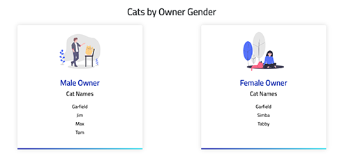

# 🐈  Developer Programming Challenge

This is a sample web application to consume json and output a list of all the cats in alphabetical order under a heading of the gender of their owner.

Example:

```yml
Male
- Angel
- Molly
- Tigger

Female
- Gizmo
- Jasper
```

## Scripts

```bash
# to install node modules (to be done once)
npm install

# to run the project
npm start

# to run test suites
npm test

# to create build
npm run build


```

## Example Output

Aims to demonstrate an understanding of the corporate visual language




## Tools and libraries used:

- JavaScript [`ES2015`](https://babeljs.io/learn-es2015/) version
- [`Webpack`](https://webpack.js.org/) as module bundler
- [`Babel JS`](https://babeljs.io/) as the compiler.
- [`Mocha JS`](https://mochajs.org/) testing framework.
- [`Chai JS`](http://chaijs.com/) as the assertion library


## Author

- **Matt Hammet** - [Hammet.com.au](http://www.hammet.com.au)


